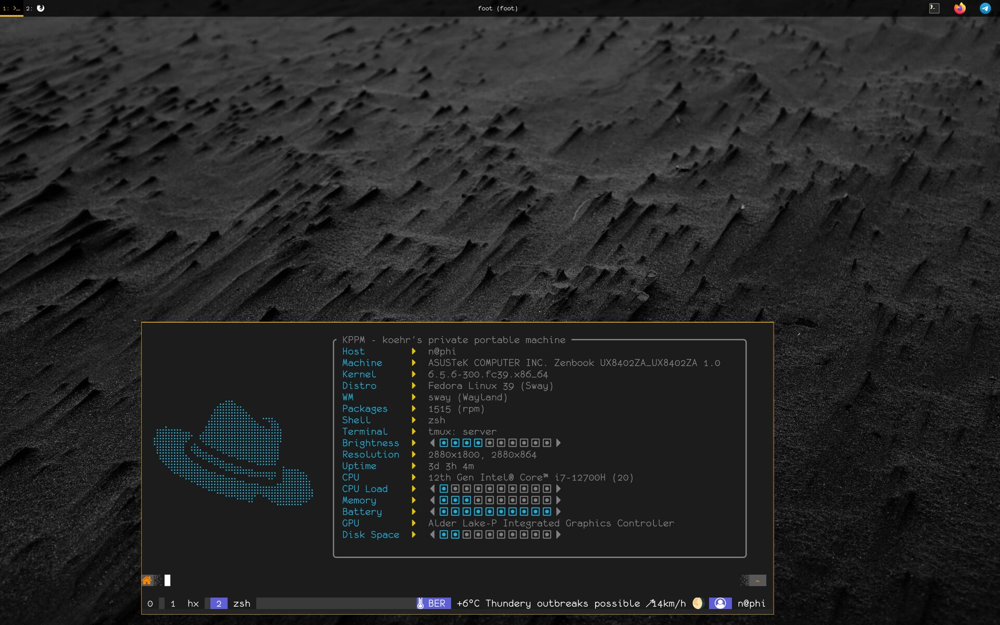
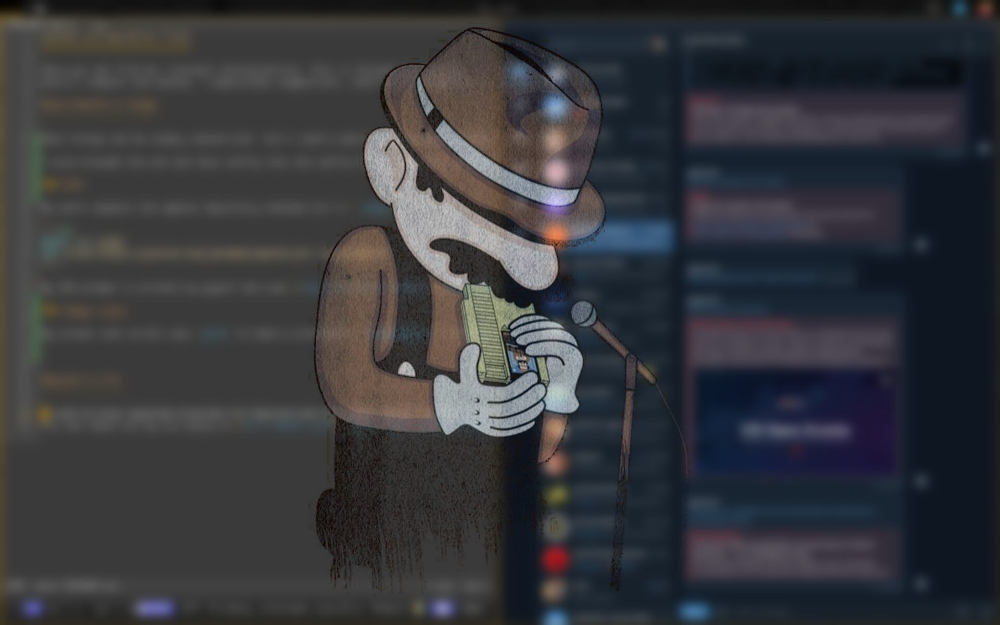

System configuration files
==========================



Here you can find all relevant configurations. This is thought equally as
public viewport and backup. I appreciate suggestions, rants and bug reports :)

Requirements & Usage
--------------------

Most things can be simply copied over or linked, but I used a special naming scheme where hidden (dot) files start with `dot`, like `.profile` becomes `dot.profile`, to ensure visibility.

I also brought the zsh config into the config folder, but still use the original config file (`~/.zshrc`) to load the actual config. This feels more consistent.

### Minimal file tree
```
 ~
├──  pkg
│   └──  zgenom
├── 󰣞 src
│   └──  configs
├──  .config
│   ├──  ashell
│   ├──  casa
│   ├──  dunst
│   ├──  helix
│   ├──  hypr
│   ├──  kitty
│   ├──  nwg-drawer
│   ├──  nwg-look
│   ├──  starship.toml
│   ├──  xdg-desktop-portal
│   ├──  xsettingsd
│   ├──  zed
│   ├──  zen
│   └──  zsh
├──  .local
│   ├──  bin
│   └──  share
│       └──  fonts
```

### ZSH

My zshrc expects the zgenom repository checked out in `~/pkg/zgenom`:

```sh
mkdir -p ~/pkg # just in case you don't have it yet
git clone https://github.com/jandamm/zgenom.git ~/pkg/zgenom
```

For a long time, I used a prompt written by myself, but at some point, I switched to [Starship](https://github.com/starship/starship). If you want to use my prompt, you should also check out [Nerdfonts](https://www.nerdfonts.com/), and if your system's package manager doesn't offer it directly, download your favourite terminal font, and install it. In my case, that looks like this:

```zsh
cd ~/tmp # here I usually unpack archives
# x is a "unpack it all" tool, installed with my zsh config
x -r ~/Downloads/Monofur.zip # -r deletes the archive after unpacking
mkdir -p ~/.local/share/fonts
cp Monofur/MonofurNerdFont-*.ttf ~/.local/share/fonts
fc-cache ~/.local/fonts
```

Now your new font (in my case monofur) should appear:

```sh
fc-list | grep -i monofur
$HOME/.local/share/fonts/MonofurNerdFont-Italic.ttf: Monofur Nerd Font:style=Italic
$HOME/.local/share/fonts/MonofurNerdFont-Regular.ttf: Monofur Nerd Font:style=Regular
$HOME/.local/share/fonts/MonofurNerdFont-Bold.ttf: Monofur Nerd Font:style=Bold
```

And with that, your (or... my...) prompt looks like

```
 󰣛                                                               󰋜    
```

Not sure if it really works here, so here's a screenshot:


#### Fedora installation

Fedora doesn't have starship in the default repos, but there is a copr:

```sh
dnf copr enable atim/starship
dnf install starship
```

If you also want [McFly](https://github.com/cantino/mcfly) for shell history, you can install it directly via Cargo (the Rust package manager):

```sh
dnf install cargo
cargo install mcfly
```

### Hyprland

I recently jumped on the hyprtrain (pun intended). My [Hyprland](https://hypr.land/) config is rather minimal, but productive. Most of the tools in the hyprland ecosystem are replacing scripts that I had to write before, because they just support everything I wanted, and usually in a better way.

My Hyprland setup uses
[Ashell](https://malpenzibo.github.io/ashell/),
[Hyprlock](https://wiki.hypr.land/Hypr-Ecosystem/hyprlock/),
[Hypridle](https://wiki.hypr.land/Hypr-Ecosystem/hypridle/),
[Hyprpaper](https://wiki.hypr.land/Hypr-Ecosystem/hyprpaper/),
[Hyprsunset](https://wiki.hypr.land/Hypr-Ecosystem/hyprsunset/) and
[Wofi](https://hg.sr.ht/~scoopta/wofi).
So pretty much standard, if that is a thing in HyprlandSetupWorld.

#### Using this on Fedora

Fedora doesn't have all the packages by default, but luckily it is easy to get them. Enable the following copr repos:
```
dnf copr enable solopasha/hyprland
dnf copr enable washkinazy/wayland-wm-extras
```

I used `washkinazy/wayland-wm-extras` instead of `killcrb/ashell`, because it came with the most recent version.

Then install all the things:

```sh
dnf install hyprland hyprlock hypridle hyprpaper hyprsunset wofi ashell
```

#### Ashell

You will also need [Zenity](https://wiki.gnome.org/Projects/Zenity) if you want to use my setup, because Ashell cannot render a calender, yet.

#### Hyprlock

Before hyprlock, I used a screen lock script that used `grim` to take a screenshot, `ImageMagick` to blur and overlay it, and finally `swaylock` to lock the screen. The result looked like this:



Hyprlock can just screenshot and blur my screen as a background, but unfortunately, cannot overlay an image, so Mario is not playing the blues anymore :/

### Terminal

I use [kitty](https://sw.kovidgoyal.net/kitty/), which seems to be by far the best choice nowadays. It is not only rendering well and fast, but meaninfully extends the protocols to allow all kinds of things. Check out the [Protocol Extensions documentation](https://sw.kovidgoyal.net/kitty/protocol-extensions/) if you are curious.

### Fedora Convenience

My distribution of choice is Fedora. My current setup is actually the [Miracle Spin](https://fedoraproject.org/spins/miraclewm/) but MiracleWM didn't work for me, so I removed everything and installed Hyprland.

Other things I'm usually installing right away, so that I don't have to look for it the next time:

```sh
dnf install htop    # shows me how much RAM my browser eats
dnf install zsh     # my shell of choice
dnf install helix   # my terminal editor of choice
dnf install ripgrep # my terminal "grep" of choice
dnf install fzf     # used by many other tools for searching
dnf install cargo   # used to install things from the Rust ecosystem
dnf install rbw     # Bitwarden CLI client: https://github.com/doy/rbw
dnf install fontawesome-fonts-all
cargo install eza   # my ls replacement of choice
cargo install mcfly # my terminal history search (ctrl+r) of choice

# also install rpm-fusion for all the media codecs,
# see: https://rpmfusion.org/Configuration

# and terra for all the other things, like Zed
sudo dnf install --nogpgcheck --repofrompath 'terra,https://repos.fyralabs.com/terra$releasever' terra-release
# optionally more freeworld media codec stuff
sudo dnf install --nogpgcheck --repofrompath 'terra-mesa,https://repos.fyralabs.com/terra$releasever' terra-release-mesa
```


Wayland vs X11
--------------

I used to have seperate branches for Wayland and X11 based setups, but all issues I had with Wayland are gone now, so there is no need for me to keep X11 configs around. You can still find them in the commit tree, though.
You can check out my old setup on [this reddit post](https://www.reddit.com/r/unixporn/comments/d0fuc1/sway_mario_plays_the_blues/).
