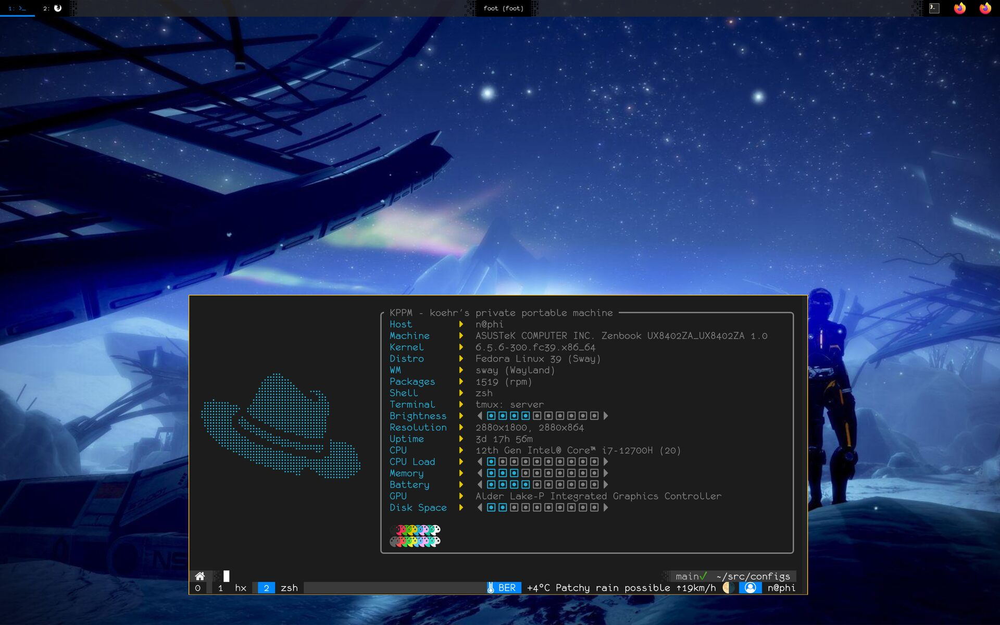
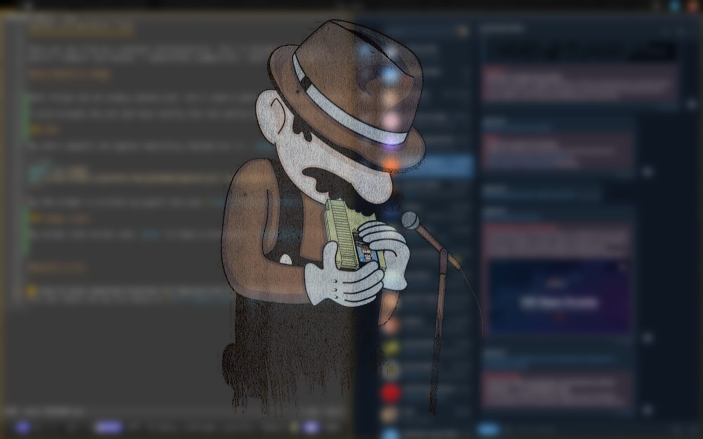

System configuration files
==========================



Here you can find all relevant configurations. This is thought equally as
public viewport and backup. I appreciate suggestions, rants and bug reports :)

Requirements & Usage
--------------------

Most things can be simply copied over, but I used a special naming scheme where hidden (dot) files start with `dot`, like `.profile` becomes `dot.profile`, to ensure visibility.

I also brought the zsh and tmux config into the config folder, but still use the original config files (`~/.zshrc` and `~/.tmux.conf` respectively) to load the actual configs. This feels more consistent in my opinion.

### ZSH

My zshrc expects the zgenom repository checked out in `~/pkg/`:

```sh
mkdir -p ~/pkg
git clone https://github.com/jandamm/zgenom.git ~/pkg/zgenom
```

My ZSH prompt is written by myself and uses [Powerline Extra Symbols](https://github.com/ryanoasis/powerline-extra-symbols), so make sure to install a compatible font. I would suggest checking out [Nerdfonts](https://www.nerdfonts.com/).

### Sway(-lock)

My screen lock script uses `grim` to take a screenshot, `ImageMagick` to blur and overlay it, and finally `swaylock` to lock the screen. The result looks like this:



Wayland vs X11
--------------

I used to have seperate branches for Wayland and X11 based setups, but all issues I had with Wayland are gone now, so there is no need for me to keep X11 configs around. You can still find them in the commit tree, though.
You can check out my old setup on [this reddit post](https://www.reddit.com/r/unixporn/comments/d0fuc1/sway_mario_plays_the_blues/).
